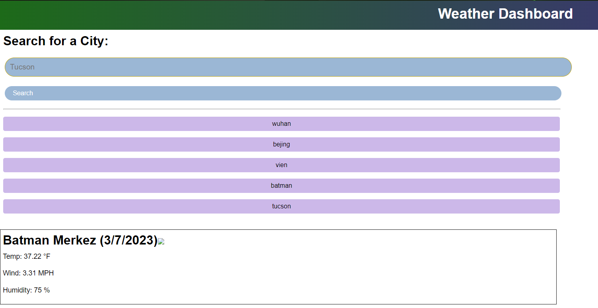
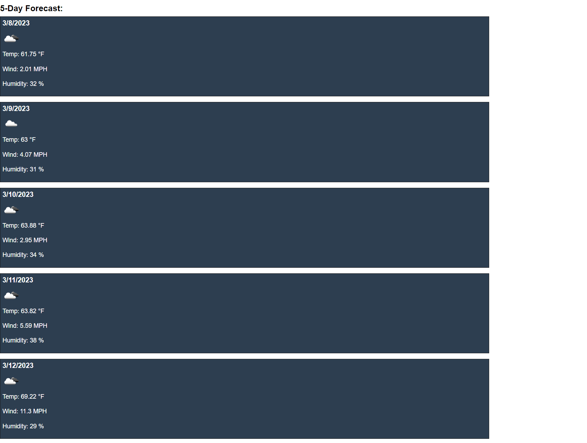

# The Drip 5 Day Forecast
## description
A 5 day weather forcast webiste that I made using the open weather map API as well as Dayjs to make a website that will be able to both tell he current weather as well as forecast the weather for the next few days. I made this not exclusivly for my class its needed for but also out of curiosity for how it would work all around and I found it to be quite intreeging.

## Usage
the site itself work fairly straight forward all that is required to run the sites operation is to input the name of a city and press enter/clikc the submit button, and the site will run and tell the current weather, as well as forecast the next few days weather shown below. 

## Credits
N/A
## License
Please refer to the LICENSE in the repo.
## Link to Deployed Site
link: 